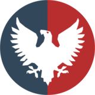

  

# TheLeagueWiki-LLM

All the files I created and used for my custom selfhosted LLM agent to be used on "The League" Wiki Roleplay project.

## Files

| File | Description |
|------|-------------|
| `wikiscraper.py` | A wiki scraper python script to scrape the entire wiki for all it's entries and parse the text into a .json ready for chunking.|
